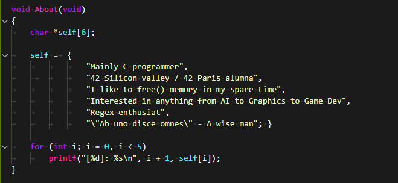
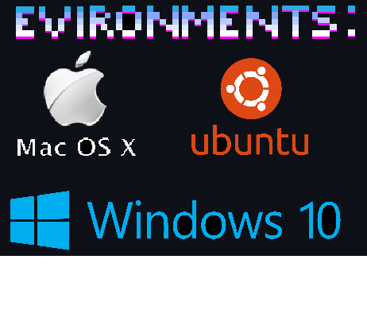
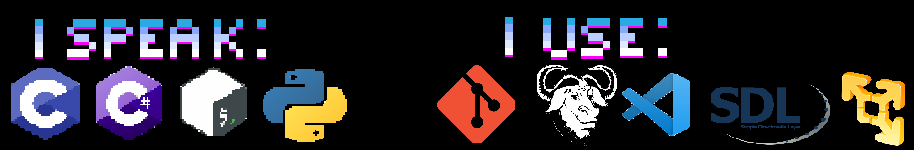

# How well, not How much

## Don't get lost~

Don't know where to go from here? Go over to the **[Mage_Portal][1]** for a list of all my fantastic projects and where to find them;

  

# Heart of the Code

- **[Repositories][2]**     | Here are mostly tools, coding problems / contests and everything of the likes;

- **[Sigma][3]**            | There lives most of the bigger projects such as rendering engines, simulations and anything involving triangles;

- **[Compute-Progress][4]** | Sandbox projects and small games to assess current skill and try new things;
 
- **[42Curriculum][5]**     | Projects I completed during my time in 42 SiliconValley / 42Paris;

## Current Projects

  

- **[RayMarcher][6]** : Coding a raymarcher in C, entirely from scratch, as I am exploring different rending techniques;

- **[SDLX][7]** : A wrapper for SDL2; Constantly updating this library with more and more tools.Feel free to open issues and let me know what you think I should add to it!

- **[Fractal][8]** : Cue the Julia set;

  

[1]: https://github.com/FlavorlessQuark/Mage_Portal
[2]: https://github.com/FlavorlessQuark?tab=repositories
[3]: https://github.com/LumenNoctis
[4]: https://github.com/Compute-Progress
[5]: https://github.com/42Curriculum
[6]: https://github.com/LumenNoctis/RayMarching
[7]: https://github.com/FlavorlessQuark/SDL_Tools
[8]: https://github.com/LumenNoctis/Fractals
