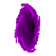

## May the Code be with you, Always.

Greetings traveler, I see that you have found my profile.

__About:__

*I have mostly been programming in* **[C][6]** *with a little bit of Python and C++ here and there.*

*If you want to know more about things I think while coding or what I'm currently doing, you are welcome to look at the* **[Task_Manager][4]** *or peer through the* **[Black_Hole][7]**

   

If you are lost, head through to the **[Mage Portal][0]** for an overview of what I have been working on

### Work it harder, make it better...

 - The assembler dwarves are currently working on **[Reinforcing the Quantum Vault][1]** in order to later upgrade its [visual][2] and [computation][3] modules.

 - In a parallel universe, elves are catching up and getting ready for this year's **[Advent of Code][5]** :star2:

[0]: https://github.com/FlavorlessQuark/Mage_Portal
[1]: https://github.com/FlavorlessQuark/Quantum_Vault
[2]: https://github.com/FlavorlessQuark/SDL_Tools
[3]: https://github.com/FlavorlessQuark/Math_Tools
[5]: https://github.com/FlavorlessQuark/Advent_of_Code
[4]: https://github.com/FlavorlessQuark/Task_Manager
[6]: https://github.com/FlavorlessQuark/C
[7]: https://github.com/FlavorlessQuark/Black_Hole
