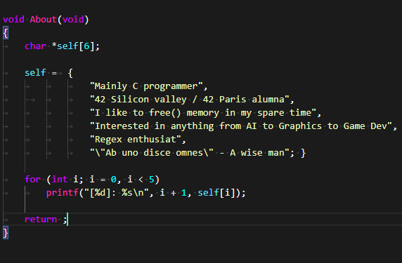
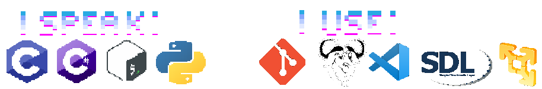

# Heart of the Code

  

## Don't get lost~

Don't know where to go from here?

Go over to the **[Mage_Portal]**[3] for a list of all my fantastic projects and where to find them.

----

My code is separated in 4 categories:

- **[Repositories]**[4] | Here are mostly tools, coding problems /contests and everything of the likes

- **[Sigma]**[5] | There lives most of the bigger projects such a rendering engines, simulations and anything involving triangles

- **[Compute-Progress]**[6] | Sandbox projects and small games to asses current skill and try new things

- **[42Curriculum]**[7] | Projects I complete during my time in 42 SiliconValley / 42Paris

## Current Projects

  

- **[RayMarcher]**[0] : Coding a raymarcher in C, entrely from scratch, as I am exploring different rending techniques;

- **[SDLX]**[1] : A wrapper for SDL2; Constantly updating this library with more and more tools.Feel free to open issues and let me know what you think I should add to it!.

- **[Fractal]**[2] : Cue the Julia set

-------

  
